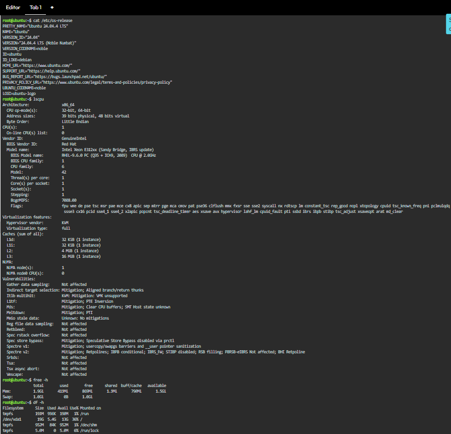

# Continue Your Linux Investigation

The KillerCoda Playground was used to inspect the main specifications of a Linux server. The investigation focused on four important areas: the operating system, processor, memory, and disk storage. Linux commands were used to obtain the information directly from the server.

### Linux Commands Used

The following commands were executed in the KillerCoda environment:

- `cat /etc/os-release` – identifies the Linux distribution and provides details about the operating system.
- `lscpu` – provides information about the processor, including its architecture and available CPU resources.
- `free -h` – shows the amount of total, used, and available memory in an easier-to-read format.
- `df -h` – checks the disk storage and shows how much space is currently used and available.

### Terminal Output

The terminal screenshot presents the information collected from the Linux server using the commands above. It serves as evidence of the system investigation performed in the KillerCoda Playground.

### Cloud Migration Recommendation

If the Linux server were transferred to a cloud environment, it could be hosted using virtual machine services from the three major cloud providers. These services provide the computing environment needed to run a Linux-based server.

- **AWS – Amazon EC2:** Provides virtual computing instances that can be configured to run Linux operating systems.
- **Microsoft Azure – Azure Virtual Machines:** Allows users to deploy Linux servers as virtual machines in the Azure environment.
- **Google Cloud Platform – Compute Engine:** Provides configurable virtual machines that can be used to host Linux servers and applications.
